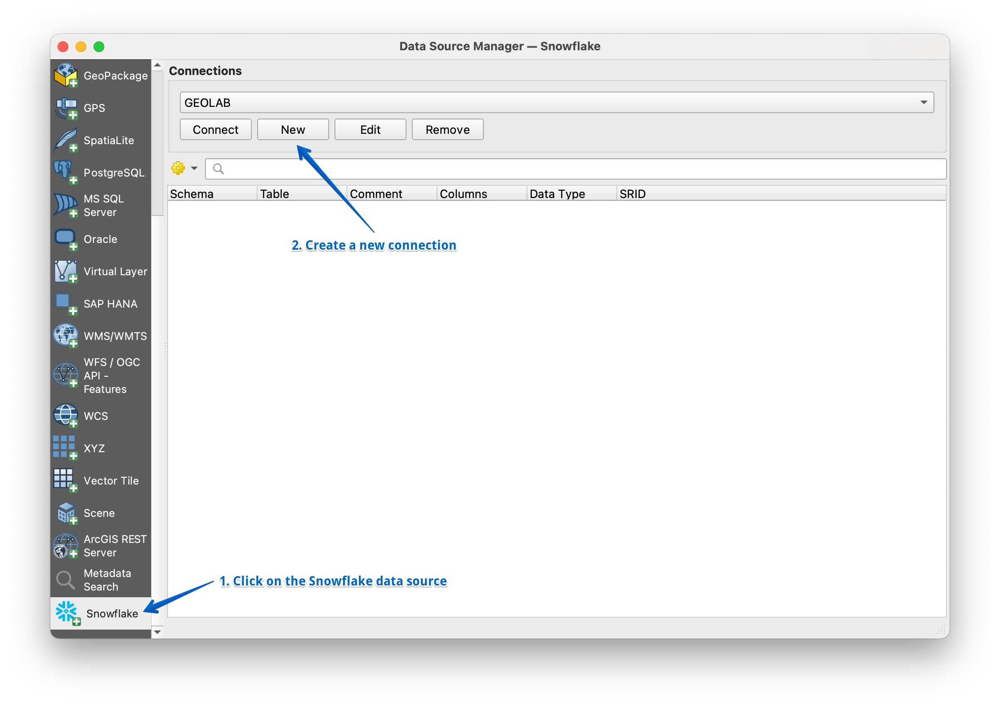

# Snowflake Connector for QGIS

## Introduction
This package includes the Snowflake Connector for QGIS.

The Snowflake Connector for QGIS provides an interface for open-source GIS application QGIS that can connect to Snowflake and perform all standard operations. It provides a connection via [Python connector](https://github.com/snowflakedb/snowflake-connector-python).

## Installation
The plugin is installed using the QGIS plugin manager.  You can try latest development versions by downloading and installing the plugin in QGIS from a zip file. These are available [here](https://github.com/snowflakedb/qgis-snowflake-connector/releases), download the zip-file "qgis-snowflake-connector.zip" for the release you want to try.

## Getting Started
1. Install the plugin with the QGIS plugin manager.
2. Go to Layer > Data Source Manager. In the list of data sources click on Snowflake and create a new connectionn

3. Add connection details and choose Connection type (default or SSO)

## Support
If you found bugs or have suggestions for improving the plugin, please [submit](https://github.com/snowflakedb/qgis-snowflake-connector/issues) the issue or contribute by creating a pull request.

Snowflake Documentation is available at:
https://docs.snowflake.com/